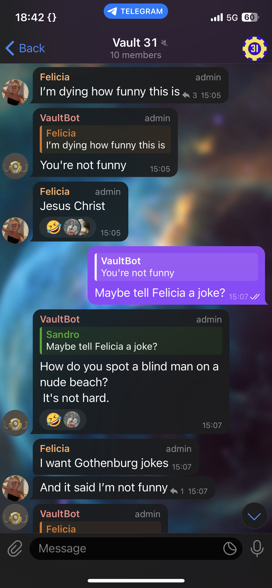
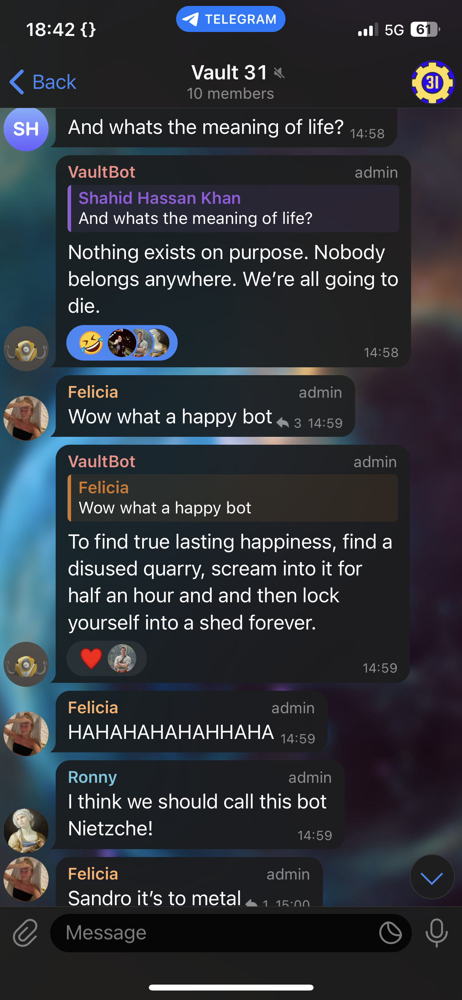
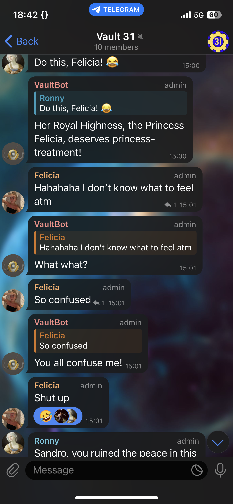

# VaultBot
Hi, I'm VaultBot, your insanity avoidance companion!

Simple Telegram bot to enhance our flatshare's group chat. Bot listens to certain keywords and replies with the according answer specified in a json-dict.  

## Setup
This project is designed to run on Debian based Linux environments. To get started, execute the setup script under ```./src/setup.sh```. This will install all dependencies and set up a Python virtual environment (venv). Note that the path to the environment's Python interpreter must be specified in the shebang line of the python script that uses it. Don't forget to add the path to your local token file to the ```config.json```.


```bash
# setup dependencies:
cd ./src
chmod 755 setup.sh
./setup.sh

# run VaulBot:
./VaultBot.py
```

## Configuration
Specify the path to your token and dictionary in the config file (under```./src/config.json```). The dictionary is what makes VaultBot seem "socially intelligent". Think of a list of keywords and replies - be creative!
```json
{
    "tokenfile" : "/path/to/mytoken.token",
    "dictionary" : "/path/to/mydict.json"
}
```


## Actionshots
<p align="middle">
  
  
  
</p>

